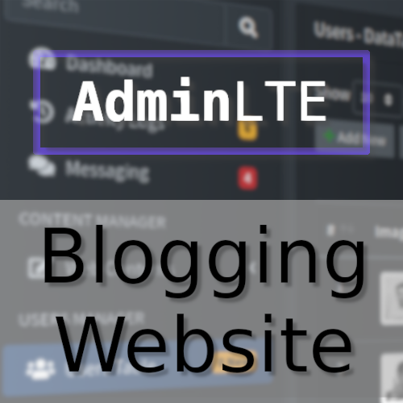

# Documentation

<p align="center"></p>

<h2 align="center">AdminLTE - Web-Blog</h1>
<div align="center">

[](https://getbootstrap.com)
[](https://jquery.com)
[](https://www.php.net)
[](https://www.mysql.com)
[](LICENSE.md)

</div>

Simple PHP blogging system.

* [Introduction](./##introduction)
  * [Demo](./###demo)
  * [Features](./###features)
* [Get started](./##get-started)
  * [Requirements](./###requirements)
* [Contact](./##contact)
* [Screenshot](./##Screenshot)
  * [Login Page](./###login-page)
  * [Dashboard v2](./###dashboard-v2)
  * [User Profile - Comments](./###user-profile-comments)
  * [User Profile - Account](./###user-profile-account)
  * [User Profile - Security](./###user-profile-security)
  * [Activity Logs](./###activity-logs)
  * [Messaging](./###messaging)
  * [Web Contents](./###web-contents)
    * [Manage Pages](./####manage-pages)
    * [Manage Posts](./####manage-posts)
    * [Manage Categories](./####manage-categories)
    * [Manage Contacts](./####manage-contacts)
    * [Manage Comments](./####manage-comments)
    * [Manage Users](./####manage-users)
  * [Site Manager](./###site-manager)
    * [Site Info](./####site-info)
    * [Site Templates](./####site-templates)
* [Contact Us](./###site-us)
* [Thank you for your purchase](./##thank-you-for-your-purchase)
* [License](./##license)

## Pengenalan

Project PHP ini adalah CMS sederhana untuk dapat melakukan <i>Blogging</i> dengan mudah. Project ini menggunakan <strong>AdminLTE</strong> sebagai <i>Admin Dashboard & Control Panel</i>. <b>AdminLTE - Web BLog</b> sangat mudah untuk diinstall. Anda dapat <i>Login</i> ke <i>Dashboard</i> untuk melakukan segala hal mulai dari membuat posting dan halaman blog, mengatur preferensi situs atau bahkan mengubah <i>Template Blog</i> Anda. Seperti inilah tampilannya setelah melakukan penginstalan:


### Demo

* Website: [http://sintara.co.id/integrating-adminLTE-docs](http://sintara.co.id/integrating-adminLTE-docs)
* App login: [http://sintara.co.id/integrating-adminLTE-docs/login.php](http://sintara.co.id/integrating-adminLTE-docs/login.php)

### Fitur

```
[+] Modern Dashboard 
[+] Secured Login
[+] Activity Logs 
[+] Users Management, Role & Permissions
[+] Messaging
[+] Web Contents Management (Pages, Posts, Post Categories, Post Comments etc)
[+] Site Settings
[+] Site Template Options
```

## Memulai

Ini adalah contoh bagaimana Anda dapat menjalankan instruksi dan menyiapkan Project Anda secara lokal ( `localhost` ). Untuk dapat menjalankan project ini secara lokal, ikuti beberapa langkah-langkah berikut ini.

### Yang dibutuhkan

Jika Anda ingin menghosting Aplikasi ini sendiri, Anda memerlukan server dengan:

```
[+] Minimum PHP v5.6
[+] Minimum MySQL v8.0
[+] mod_rewrite Apache
```

### Instalasi

1. Instal XAMPP atau WAMPP.
2. Buka Control Panel XAMPP dan Start \[apache] dan \[mysql].
3. Unduh dan Unzip file yang diberikan dan pindahkan ke htdocs `C:\xampp\htdocs`.
4. Buka tautan `http://localhost/phpmyadmin`.
5. Klik baru di navbar samping.
6. Beri nama database sebagai `blog_db` tekan tombol Create.
7. Setelah membuat nama database klik Import.
8. Browse file di direktori `webblog/database/blog_db.sql`.
9. Buka browser apa saja dan ketik alamat atau URL `http://localhost/talif-blog/login.php`.

## Screenshots
* ### Login Page
  

* ### Dashboard v2
  

* ### User Profile - Comments
  

* ### User Profile - Account
  

* ### User Profile - Security
  

* ### Activity Logs
  

* ### Messaging
  

* ### Web Contents
  * #### Manage Pages
    

  * #### Manage Posts
    

  * #### Manage Categories
    

  * #### Manage Contacts
    

  * #### Manage Comments
    

  * #### Manage Users
    

* ### Site Manager
  * #### Site Info
    

  * #### Site Templates
    

## Contact

<b>Created:</b> 27 Sep 2022</br>
<b>By:</b> Agah Nata</br>
<b>Email:</b> [hashcat80@gmail.com](mailto:hashcat80@gmail.com)

## Thank you for your purchase

Thank you for purchasing our product. If you have any questions that are beyond the scope of this help file, please feel free to email. Thanks so much!.

## License

Copyright © 2022

Licensed under [the AGPL License](LICENSE.md).
